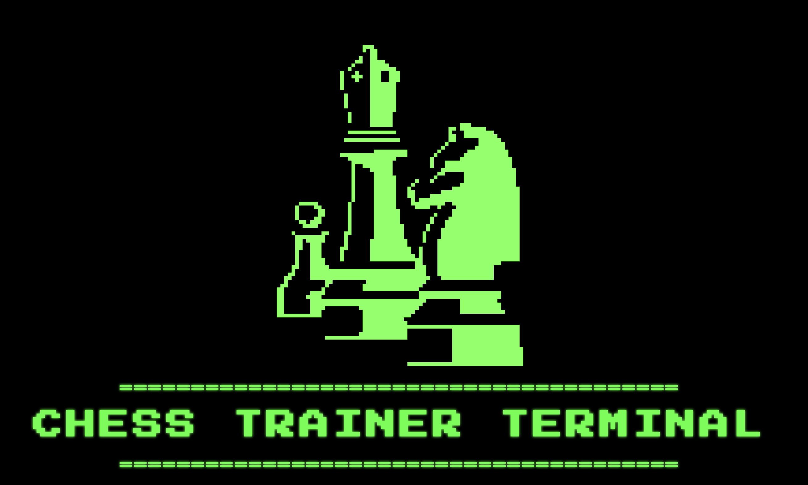

# ♟️ Chess Trainer

Sistema completo de entrenamiento de ajedrez con backend FastAPI y frontend React + Vite.

[](https://www.python.org/)
[](https://fastapi.tiangolo.com/)
[](https://react.dev/)
[](LICENSE)
[](docs/changelog/CAMBIOS_v2.0.0.md)



## 🎉 Nuevo en v2.0.0

**Refactorización completa** con arquitectura de protocolos:
- ✨ **~500 líneas de código duplicado eliminadas**
- 🏗️ **Sistema de protocolos** (UCI, REST, LocalLLM, APILLM)
- 🎨 **Patrones Bridge + Composition** aplicados
- 📦 **100% retrocompatible** con configuraciones existentes
- 📚 **Documentación completa** de la nueva arquitectura
- 🎨 **Frontend React** con UI retro y moderno

👉 **[Ver cambios completos](docs/changelog/CAMBIOS_v2.0.0.md)** | **[Documentación técnica](docs/architecture/REFACTORIZACION_PROTOCOLOS.md)** | **[Ejemplos de uso](docs/development/EJEMPLO_USO_PROTOCOLOS.md)**

## 🚀 Características

### Backend
- **Arquitectura Modular**: Soporta motores tradicionales (Stockfish), neuronales (LCZero) y generativos (GPT-4)
- **API REST**: Interfaz unificada para todos los motores
- **Extensible**: Añade nuevos motores sin modificar el código base
- **Asíncrono**: Máxima performance con async/await
- **Validación Inteligente**: Schema para motores tradicionales, Prompt parsing para LLMs
- **Configuración YAML**: Gestión centralizada de motores

### Frontend
- **UI Retro**: Interfaz inspirada en terminales de los 80s
- **React 19**: Framework moderno con las últimas características
- **Vite**: Build tool rápido y eficiente
- **Chess.js**: Motor de ajedrez en JavaScript
- **React Chessboard**: Componente visual del tablero

## 📋 Requisitos Previos

- **Python 3.9+**
- **Conda**: El proyecto usa el entorno conda `chess` (opcional)
- **Node.js**: Instalado en el sistema
- **npm**: Para gestionar dependencias del frontend
- **Stockfish**: Para motores UCI locales (opcional)

## 🛠 Instalación

### Configuración Inicial

1. **Clonar repositorio**:
```bash
git clone <repo-url>
cd chessTrainer
```

2. **Crear entorno virtual** (Python):
```bash
python -m venv venv
source venv/bin/activate  # En Windows: venv\Scripts\activate
pip install -r requirements.txt
```

3. **Instalar dependencias del frontend**:
```bash
cd frontend
npm install
cd ..
```

## 🚀 Inicio Rápido

### Backend

```bash
# Activar entorno virtual
source venv/bin/activate  # En Windows: venv\Scripts\activate

# Iniciar servidor
python main.py
```

El servidor estará disponible en `http://localhost:8000`

### Frontend

#### Opción 1: Scripts Automáticos (Recomendado)

```bash
# Iniciar servidor frontend
bash start_frontend.sh

# Detener servidor
bash stop_frontend.sh
```

#### Opción 2: Manual

```bash
cd frontend
npm run dev
```

El frontend estará disponible en `http://localhost:5173`

## 🎮 Uso Rápido

### API Backend

#### 1. Listar Motores Disponibles

```bash
curl http://localhost:8000/engines
```

#### 2. Obtener Mejor Movimiento

```bash
curl -X POST http://localhost:8000/move \
  -H "Content-Type: application/json" \
  -d '{
    "engine": "stockfish-local",
    "fen": "rnbqkbnr/pppppppp/8/8/8/8/PPPPPPPP/RNBQKBNR w KQkq - 0 1",
    "depth": 20
  }'
```

#### 3. Comparar Todos los Motores

```bash
curl -X POST http://localhost:8000/compare \
  -H "Content-Type: application/json" \
  -d '{
    "fen": "rnbqkbnr/pppppppp/8/8/8/8/PPPPPPPP/RNBQKBNR w KQkq - 0 1",
    "depth": 15
  }'
```

### Frontend

1. Abre `http://localhost:5173` en tu navegador
2. Selecciona los motores para jugar
3. ¡Juega!

## ⚙️ Configuración

La configuración de motores está dividida en dos archivos:

- **`config/engines_local.yaml`**: Motores locales (no requieren tokens de API)
- **`config/engines_external.yaml`**: Motores externos (requieren tokens de API)

### Motores Locales (`engines_local.yaml`)

```yaml
engines:
  # Motor tradicional UCI local
  stockfish-local:
    engine_type: traditional_uci
    type: uci
    command: "stockfish"
    default_depth: 15
```

### Motores Externos (`engines_external.yaml`)

```yaml
engines:
  # Motor generativo (LLM) - Usa variables de entorno para API keys
  gpt-4o-mini:
    engine_type: generative
    provider: openai
    model: "gpt-4o-mini"
    # api_key se lee automáticamente desde variable de entorno OPENAI_API_KEY
```

**Nota**: El sistema carga ambos archivos automáticamente. Los motores están organizados por tipo (tradicionales, neuronales, generativos) dentro de cada archivo.

### Configuración de API Keys

Las API keys se configuran mediante variables de entorno para mayor seguridad:

1. **Copia el archivo de ejemplo**:
   ```bash
   cp .env.example .env
   ```

2. **Edita `.env`** y añade tus API keys:
   ```bash
   OPENAI_API_KEY=sk-tu-api-key-aqui
   ```

3. **El sistema busca las API keys en este orden**:
   - `{PROVIDER}_API_KEY` (ej: `OPENAI_API_KEY`)
   - `{ENGINE_NAME}_API_KEY` (ej: `GPT_4O_MINI_API_KEY`)
   - `API_KEY` (genérico)

**Modelos GPT gratuitos disponibles**:
- `gpt-4o-mini` - Velocidad promedio
- `gpt-3.5-turbo-0125`
- `gpt-3.5-turbo-1106`
- `gpt-3.5-turbo` - Versión estándar
- `gpt-3.5-turbo-16k` - Contexto extendido
- `net-gpt-3.5-turbo` - Con búsqueda en red (menos estable)

## 🏗 Arquitectura

### Estructura del Proyecto

```
chessTrainer/
├── engines/              # Módulo de motores (backend)
│   ├── base.py          # Clase base y enums
│   ├── validators.py    # Validadores (Schema y Prompt)
│   ├── traditional.py   # Motores tradicionales
│   ├── neuronal.py      # Motores neuronales
│   ├── generative.py    # Motores generativos (LLM)
│   └── factory.py       # Factory y Registry
├── frontend/            # Aplicación React
│   ├── src/
│   │   ├── App.jsx
│   │   ├── GamePage.jsx
│   │   └── ...
│   ├── package.json
│   └── vite.config.js
├── config/
│   ├── engines_local.yaml     # Motores locales (sin API keys)
│   └── engines_external.yaml  # Motores externos (con API keys)
├── docs/                # Documentación
├── engine_manager.py    # Gestor de motores
├── main.py             # API FastAPI
├── start_frontend.sh   # Script de inicio frontend
├── stop_frontend.sh    # Script de detención frontend
└── requirements.txt    # Dependencias Python
```

## 🌐 API Endpoints

### Información
- `GET /` - Servir frontend o redirigir a desarrollo
- `GET /api` - Información general de la API
- `GET /health` - Estado de salud
- `GET /engines` - Lista de motores disponibles
- `GET /engines/info` - Información detallada de motores
- `GET /engines/matrix` - Matriz de clasificación

### Operaciones
- `POST /move` - Obtener mejor movimiento de un motor
- `POST /compare` - Comparar sugerencias de todos los motores
- `POST /reload` - Recargar configuración sin reiniciar

## 🎯 Tipos de Motores

### 1. Motores Tradicionales
- Algoritmos deterministas (minimax, alfa-beta)
- Ejemplos: Stockfish, Komodo, Houdini

### 2. Motores Neuronales
- Redes neuronales + búsqueda MCTS
- Ejemplos: Leela Chess Zero, AlphaZero

### 3. Motores Generativos
- Basados en LLMs
- Pueden explicar decisiones
- Ejemplos: GPT-4, Claude

## 📚 Documentación

> 👉 **[Índice completo de documentación](docs/README.md)** - Navegación organizada por categorías

### Documentación Detallada
- [**ARQUITECTURA.md**](docs/architecture/ARQUITECTURA.md) - Arquitectura completa del sistema
- [**REFACTORIZACION_PROTOCOLOS.md**](docs/architecture/REFACTORIZACION_PROTOCOLOS.md) - Sistema de protocolos
- [**patrones_diseño.md**](docs/architecture/patrones_diseño.md) - Patrones de diseño utilizados

## 🔧 Desarrollo

### Backend

```bash
# Tests
pytest

# Linting
flake8 engines/ engine_manager.py main.py

# Formato
black engines/ engine_manager.py main.py
```

### Frontend

```bash
cd frontend

# Desarrollo
npm run dev

# Build producción
npm run build

# Preview build
npm run preview

# Linting
npm run lint
```

## 🐛 Solución de Problemas

### Backend
- Los motores LLM requieren API keys válidas
- LCZero puede requerir configuración adicional de GPU
- Algunos motores externos tienen rate limits

### Frontend
- Verificar que el puerto 5173 está libre: `lsof -i :5173`
- Si hay problemas, usar `bash stop_frontend.sh` y luego `bash start_frontend.sh`
- Reinstalar dependencias: `cd frontend && rm -rf node_modules && npm install`

## 🤝 Contribuir

Las contribuciones son bienvenidas. Por favor:

1. Fork el proyecto
2. Crea una rama para tu feature (`git checkout -b feature/AmazingFeature`)
3. Commit tus cambios (`git commit -m 'Add some AmazingFeature'`)
4. Push a la rama (`git push origin feature/AmazingFeature`)
5. Abre un Pull Request

## 📝 Roadmap

- [x] Arquitectura base modular
- [x] Motores tradicionales (UCI y REST)
- [x] Motores neuronales
- [x] Motores generativos (LLM)
- [x] Sistema de Factory y Registry
- [x] API REST completa
- [x] Frontend React con UI retro
- [ ] Tests unitarios completos
- [ ] Motores híbridos (LLM + Tradicional)
- [ ] Integración con LangGraph
- [ ] Dashboard web interactivo
- [ ] Análisis de partidas completas
- [ ] Sistema de entrenamiento personalizado

## 📄 Licencia

Este proyecto está bajo la Licencia MIT. Ver archivo [LICENSE](LICENSE) para más detalles.

## 👥 Autores

- Chess Trainer Team

## 🙏 Agradecimientos

- [Stockfish](https://stockfishchess.org/) - Motor de ajedrez open source
- [Leela Chess Zero](https://lczero.org/) - Motor neuronal open source
- [python-chess](https://python-chess.readthedocs.io/) - Librería de ajedrez
- [FastAPI](https://fastapi.tiangolo.com/) - Framework web moderno
- [React](https://react.dev/) - Biblioteca de JavaScript
- [Vite](https://vitejs.dev/) - Build tool moderno

---

**Versión**: 2.0.0  
**Última actualización**: 2025

Para más información, consulta la [documentación completa](docs/architecture/ARQUITECTURA.md).
