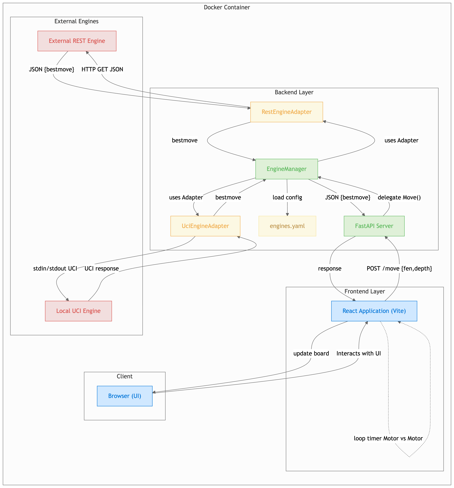

# 🏗️ Evolución de la Arquitectura del Proyecto: De la Instancia Inicial al Estado Actual

## 🎯 Introducción

Este documento detalla la arquitectura inicial del proyecto "Chess Trainer" basada en el diseño original (`diagram.png`) y la contrasta con su estado actual, destacando las mejoras, refactorizaciones y la madurez alcanzada en la implementación.

---

## 📐 Arquitectura en la Primera Instancia (Basada en `diagram.png`)

En su concepción inicial, el proyecto "Chess Trainer" se diseñó con una arquitectura modular y distribuida, encapsulada principalmente dentro de un **Docker Container**. El objetivo principal era separar claramente las responsabilidades entre la interfaz de usuario, la lógica de negocio del servidor y la interacción con los motores de ajedrez externos.

> **Nota**: Este diagrama representa la arquitectura inicial del proyecto. La imagen se encuentra en `docs/images/diagram.png`.

### Estructura General del Docker Container

El sistema estaba organizado en tres capas principales dentro del contenedor Docker:

1. **External Engines Layer** (Capa de Motores Externos)
2. **Backend Layer** (Capa de Backend)
3. **Frontend Layer** (Capa de Frontend)

Además, fuera del contenedor Docker se encontraba el **Client** (Cliente final).

---

### 1. External Engines (Motores Externos)

Esta sección, ubicada en la parte superior izquierda del diagrama, contenía dos tipos de motores de ajedrez externos que representaban diferentes formas de interacción:

#### External REST Engine (Motor REST Externo)
- **Tipo**: Motor de ajedrez remoto
- **Comunicación**: HTTP GET con formato JSON
- **Protocolo**: REST API
- **Flujo**:
  - Envía solicitud: `HTTP GET JSON` con parámetros de posición
  - Recibe respuesta: `JSON {bestmove}` con el mejor movimiento calculado
- **Características**: 
  - Comunicación basada en protocolo HTTP estándar
  - Interfaz basada en peticiones y respuestas JSON
  - Requiere conexión de red al servicio remoto

#### Local UCI Engine (Motor UCI Local)
- **Tipo**: Motor de ajedrez local
- **Comunicación**: Interfaz UCI (Universal Chess Interface) a través de `stdin/stdout`
- **Protocolo**: UCI estándar de la industria
- **Flujo**:
  - Envía comandos: `stdin/stdout UCI` (comandos UCI como `position`, `go`, etc.)
  - Recibe respuesta: `UCI response` con el mejor movimiento
- **Características**:
  - Ejecución local en el mismo sistema
  - Comunicación mediante entrada/salida estándar
  - Ejemplos: Stockfish, Leela Chess Zero, Komodo

---

### 2. Backend Layer (Capa de Backend)

Esta era la capa central del sistema, ubicada en la parte superior derecha y centro del contenedor Docker. Contenía la lógica principal del servidor y la gestión de motores:

#### RestEngineAdapter (Adaptador de Motor REST)
- **Propósito**: Adaptador específico para comunicarse con el `External REST Engine`
- **Responsabilidades**:
  - Traducir solicitudes del `EngineManager` a formato HTTP GET
  - Recibir `bestmove` del motor externo REST
  - Normalizar la respuesta para el `EngineManager`
- **Interfaz**: 
  - Entrada: Solicitud de movimiento desde `EngineManager`
  - Salida: `bestmove` normalizado hacia `EngineManager`

#### UciEngineAdapter (Adaptador de Motor UCI)
- **Propósito**: Adaptador para comunicarse con el `Local UCI Engine`
- **Responsabilidades**:
  - Gestionar la comunicación UCI estándar
  - Enviar comandos UCI a través de `stdin/stdout UCI`
  - Recibir `UCI response` del motor local
  - Extraer y normalizar el `bestmove` de la respuesta UCI
- **Interfaz**:
  - Entrada: Solicitud de movimiento desde `EngineManager`
  - Salida: `bestmove` normalizado hacia `EngineManager`

#### EngineManager (Gestor de Motores)
- **Propósito**: El corazón del backend, orquestador central de todos los motores
- **Responsabilidades Principales**:
  1. **"uses Adapter"**: 
     - Se conecta tanto al `RestEngineAdapter` como al `UciEngineAdapter`
     - Permite interactuar con diferentes tipos de motores a través de sus respectivos adaptadores
     - Implementa el patrón Adapter para abstraer las diferencias entre motores
  
  2. **"load config"**: 
     - Lee la configuración de los motores desde un archivo `engines.yaml`
     - Este archivo contenía la definición de qué motores están disponibles
     - Configuración incluía rutas, parámetros y tipos de cada motor
  
  3. **"JSON {bestmove}"**: 
     - Envía el mejor movimiento encontrado al `FastAPI Server`
     - Formato normalizado independientemente del tipo de motor usado
  
  4. **"delegate Move()"**: 
     - Delega la solicitud de movimiento al `FastAPI Server`
     - Actúa como intermediario entre la API y los motores

#### FastAPI Server
- **Propósito**: Servidor web principal que expone la API REST
- **Endpoints Principales**:
  - `POST /move {fen, depth}`: Endpoint principal para solicitar movimientos
- **Flujo de Comunicación**:
  1. Recibe `POST /move {fen,depth}` del `Frontend Layer`
  2. Envía solicitud `JSON {bestmove}` al `EngineManager` para obtener un movimiento
  3. Recibe `bestmove` del `EngineManager`
  4. Envía `response` de vuelta al `Frontend Layer` con el movimiento calculado
- **Características**:
  - Framework web asíncrono FastAPI
  - Manejo de peticiones HTTP concurrentes
  - Serialización/deserialización automática de JSON

---

### 3. Frontend Layer (Capa de Frontend)

Esta capa, ubicada en la parte inferior derecha dentro del "Docker Container", era la interfaz de usuario de la aplicación:

#### React Application (Vite)
- **Framework**: React con Vite como build tool
- **Responsabilidades**:
  1. **"Interacts with UI"**: 
     - Gestión de la interfaz de usuario interna
     - Manejo de eventos y estado de la aplicación React
  
  2. **"update board"**: 
     - Envía actualizaciones del tablero al `Browser (UI)` del cliente
     - Sincroniza el estado visual del tablero de ajedrez
  
  3. **"loop timer Motor vs Motor"**: 
     - Lógica interna representada por una línea punteada auto-referencial
     - Gestiona partidas automáticas entre dos motores
     - Implementa un ciclo que alterna movimientos entre motores automáticamente
  
  4. **Comunicación con Backend**:
     - Envía `POST /move {fen,depth}` al `FastAPI Server`
     - Recibe `response` del `FastAPI Server` con el movimiento calculado

---

### 4. Client (Cliente)

Esta sección, ubicada en la parte inferior izquierda fuera del "Docker Container", representaba al usuario final:

#### Browser (UI) (Navegador - Interfaz de Usuario)
- **Propósito**: Navegador web del usuario que ejecuta la aplicación
- **Responsabilidades**:
  - Recibe "update board" de la `React Application (Vite)`
  - Renderiza visualmente el tablero de ajedrez y los controles
  - Interactúa con la `React Application (Vite)` (implícito, ya que el navegador ejecuta la aplicación React)
- **Características**:
  - Ejecuta el código JavaScript compilado de React
  - Maneja eventos del usuario (clicks, arrastres, etc.)
  - Muestra la interfaz gráfica final al usuario

---

### Flujo de Interacción Principal (Arquitectura Inicial)

El flujo típico de operación en la arquitectura inicial seguía estos pasos:

1. **Interacción del Usuario**: 
   - El `Browser (UI)` del cliente permite al usuario interactuar con la `React Application (Vite)`
   - El usuario puede hacer movimientos, seleccionar motores, o iniciar partidas

2. **Solicitud de Movimiento**:
   - La `React Application (Vite)` envía una solicitud `POST /move {fen,depth}` al `FastAPI Server`
   - La solicitud incluye la posición actual del tablero (FEN) y la profundidad de análisis deseada

3. **Delegación al Gestor**:
   - El `FastAPI Server` delega la solicitud al `EngineManager`
   - El `EngineManager` decide qué motor usar basándose en la configuración de `engines.yaml`

4. **Comunicación con el Motor**:
   - El `EngineManager` utiliza el adaptador correspondiente:
     - `RestEngineAdapter` para motores REST externos
     - `UciEngineAdapter` para motores UCI locales
   - El adaptador se comunica con el motor (HTTP GET para REST o stdin/stdout para UCI)

5. **Obtención del Mejor Movimiento**:
   - El motor externo (`External REST Engine` o `Local UCI Engine`) calcula y devuelve el `bestmove`
   - El adaptador normaliza la respuesta y la pasa al `EngineManager`

6. **Retorno al Servidor**:
   - El `EngineManager` envía el `JSON {bestmove}` al `FastAPI Server`
   - El servidor prepara la respuesta final

7. **Actualización del Frontend**:
   - El `FastAPI Server` envía la `response` de vuelta a la `React Application (Vite)`
   - La aplicación React usa el `bestmove` para actualizar el estado interno

8. **Renderizado Final**:
   - La `React Application (Vite)` envía "update board" al `Browser (UI)`
   - El navegador renderiza visualmente el nuevo estado del tablero

9. **Partidas Automáticas** (Motor vs Motor):
   - La lógica interna "loop timer Motor vs Motor" permite que dos motores jueguen entre sí automáticamente
   - El ciclo se repite alternando movimientos entre los dos motores seleccionados

---

## 🚀 Arquitectura Actual: Resumen Condensado

El proyecto ha evolucionado significativamente desde su diseño inicial, manteniendo la robustez y modularidad del diseño original, pero incorporando mejoras sustanciales en la organización del código, la seguridad, la configuración y la experiencia de desarrollo.

### Mejoras Principales Implementadas

#### 1. **Backend (FastAPI) - Mejoras y Refactorizaciones**

##### Sistema de Protocolos (v2.0.0)
- **Refactorización completa**: Implementación del patrón Bridge para separar la lógica de negocio de la comunicación
- **Reducción de código**: ~500 líneas de código duplicado eliminadas
- **Módulo `engines/protocols/`**: 
  - 5 protocolos de comunicación centralizados: `UCIProtocol`, `RESTProtocol`, `LocalLLMProtocol`, `APILLMProtocol`, `ProtocolBase`
  - Código reutilizable y extensible
  - Fácil adición de nuevos protocolos sin modificar motores existentes

##### Gestión de Motores Mejorada
- **`EngineManager`**: Mantiene su función central pero con arquitectura más limpia
- **Sistema de Factory**: Creación dinámica de motores desde configuración YAML
- **Registry Pattern**: Registro centralizado de tipos de motores
- **Soporte ampliado**: Motores tradicionales, neuronales y generativos (LLM)

##### API REST Robusta
- **Endpoints expandidos**:
  - `GET /engines` - Lista de motores disponibles
  - `GET /engines/info` - Información detallada de motores
  - `GET /engines/matrix` - Matriz de clasificación
  - `POST /move` - Obtener mejor movimiento
  - `POST /compare` - Comparar múltiples motores
  - `POST /reload` - Recargar configuración sin reiniciar
  - `GET /health` - Estado de salud del servidor
  - `GET /api` - Información de la API

##### Seguridad Mejorada - CORS Optimizado
- **Configuración inteligente**: 
  - Desarrollo: Permite localhost en puertos comunes (5173, 3000, 8080)
  - Producción: Lista específica de dominios permitidos
  - Variables de entorno: Configuración flexible mediante `CORS_ORIGINS` y `ENVIRONMENT`
- **Restricciones específicas**:
  - Métodos limitados: Solo `GET`, `POST`, `OPTIONS` (en lugar de `["*"]`)
  - Headers específicos: Solo los necesarios (Content-Type, Authorization, etc.)
  - Cache de preflight: Optimización con `max_age=3600`

##### Logging y Monitoreo
- **Sistema de logging estructurado**: Información detallada para debugging
- **Registro de CORS**: Log de orígenes permitidos al iniciar
- **Manejo de errores mejorado**: Mensajes informativos y logging detallado

##### Servir Frontend
- **Modo producción**: Capacidad de servir archivos estáticos del frontend compilado
- **Modo desarrollo**: Redirección automática al servidor Vite de desarrollo
- **Integración completa**: Backend y frontend funcionando juntos

---

#### 2. **Frontend (React + Vite) - Refactorización y Mejoras**

##### Módulo `api.js` - Comunicación Centralizada
- **Separación de responsabilidades**: Toda la comunicación con el backend en un módulo dedicado
- **Funciones principales**:
  - `getBackendUrl()`: Detección automática de entorno (desarrollo/producción)
  - `fetchEngines()`: Obtener lista de motores disponibles
  - `fetchBestMove()`: Solicitar movimiento de un motor
  - `checkBackendHealth()`: Verificar estado del backend
- **Ventajas**:
  - Código reutilizable entre componentes
  - Mantenimiento centralizado
  - Testing más simple
  - Manejo de errores consistente
  - Logging detallado para debugging

##### Componentes React Mejorados

**`App.jsx` (SelectionPage)**:
- **Estados mejorados**: 
  - `isLoadingEngines`: Indicador de carga
  - `engineError`: Manejo de errores con mensajes claros
  - `availableEngines`: Lista de motores disponibles
- **Feedback visual**: 
  - Mensajes de carga claros
  - Indicadores de error visibles
  - Información de motores en tiempo real
- **Comunicación optimizada**: Uso de `fetchEngines()` desde `api.js`

**`GamePage.jsx`**:
- **Lógica de turnos automática**: 
  - Detección automática de qué motor debe jugar según el turno
  - `getCurrentPlayer()`: Determina el jugador actual (motor o humano)
  - Prevención de bucles infinitos con `lastMoveWasEngineRef`
- **Manejo de movimientos mejorado**:
  - Uso de `fetchBestMove()` desde `api.js`
  - Soporte para explicaciones de motores generativos
  - Manejo robusto de errores con mensajes informativos
- **Estados de juego**: 
  - `isProcessing`: Prevención de múltiples llamadas simultáneas
  - Actualización automática del estado del juego
  - Feedback visual durante el procesamiento

##### UI/UX Mejorada
- **Interfaz retro**: Diseño inspirado en terminales de los 80s
- **Feedback visual claro**: 
  - Indicadores de estado del sistema
  - Mensajes de error comprensibles
  - Información de motores en tiempo real
- **Experiencia fluida**: 
  - Transiciones suaves entre estados
  - Actualizaciones automáticas del tablero
  - Partidas motor vs motor completamente automáticas

---

#### 3. **Integración y Despliegue**

##### Git y Ramas
- **Estructura de ramas**: 
  - `main`: Rama principal con backend y frontend integrados
  - `develop/backend`: Desarrollo del backend
  - `develop/frontend`: Desarrollo del frontend
- **`.gitignore` unificado**: 
  - Ignora `engines/` en rama frontend
  - Ignora `frontend/` en rama backend
  - Consistencia entre ramas

##### Docker
- **Mantenimiento**: El proyecto sigue diseñado para ejecutarse en Docker Container
- **Despliegue simplificado**: Entorno consistente y reproducible

##### Documentación
- **README.md completo**: Documenta tanto backend como frontend
- **Changelog detallado**: Registro de cambios y mejoras
- **Documentación técnica**: Guías de arquitectura y desarrollo

---

### Comparación: Antes vs Ahora

| Aspecto | Arquitectura Inicial | Arquitectura Actual |
|---------|---------------------|---------------------|
| **Comunicación Frontend-Backend** | Código disperso en componentes | Módulo `api.js` centralizado |
| **Gestión de Motores** | Adaptadores básicos (REST, UCI) | Sistema de protocolos extensible (5 tipos) |
| **CORS** | `allow_origins=["*"]` (inseguro) | Configuración específica por entorno |
| **API Endpoints** | Básico (`POST /move`) | Completo (8+ endpoints) |
| **Manejo de Errores** | Básico | Robusto con logging detallado |
| **Estados de UI** | Simples | Mejorados con feedback visual |
| **Lógica de Turnos** | Básica | Automática con prevención de bucles |
| **Código Duplicado** | Presente | Eliminado (~500 líneas) |
| **Testing** | Difícil (requiere componentes) | Fácil (funciones aisladas) |
| **Mantenibilidad** | Media | Alta (código organizado) |

---

## 📊 Métricas de Mejora

### Reducción de Código
- **~500 líneas eliminadas**: Código duplicado removido mediante sistema de protocolos
- **Reutilización**: Funciones compartidas entre múltiples componentes

### Mejoras de Seguridad
- **CORS**: De permisivo (`["*"]`) a restrictivo (orígenes específicos)
- **Métodos HTTP**: De todos (`["*"]`) a solo necesarios (`GET`, `POST`, `OPTIONS`)
- **Headers**: De todos (`["*"]`) a específicos (Content-Type, Authorization, etc.)

### Experiencia de Desarrollo
- **Debugging**: Logging detallado en frontend y backend
- **Mantenimiento**: Cambios centralizados en lugar de múltiples archivos
- **Testing**: Funciones aisladas más fáciles de probar

---

## 🎯 Conclusión

La arquitectura del proyecto "Chess Trainer" ha evolucionado de un diseño inicial sólido y modular a una implementación madura, robusta y bien organizada. Las mejoras principales incluyen:

✅ **Separación de responsabilidades**: Código más limpio y organizado  
✅ **Reutilización**: Menos duplicación, más eficiencia  
✅ **Seguridad**: Configuración CORS optimizada y segura  
✅ **Mantenibilidad**: Cambios centralizados y fáciles de realizar  
✅ **Escalabilidad**: Fácil añadir nuevos motores y protocolos  
✅ **Experiencia de usuario**: Feedback visual mejorado y partidas fluidas  
✅ **Testing**: Funciones aisladas más fáciles de probar  

El proyecto mantiene su filosofía original de modularidad y separación de capas, pero ahora con una implementación más refinada, segura y fácil de mantener.

---

**Fecha de creación**: 2025  
**Archivo relacionado**: `diagram.png` (raíz del proyecto)  
**Estado**: Arquitectura actual implementada y funcionando

