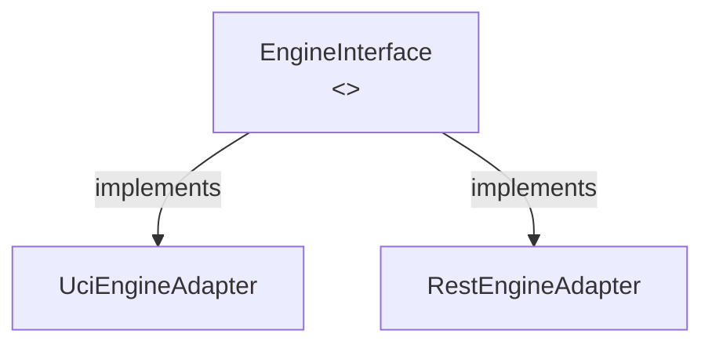
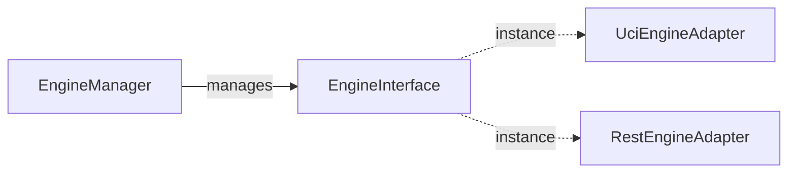
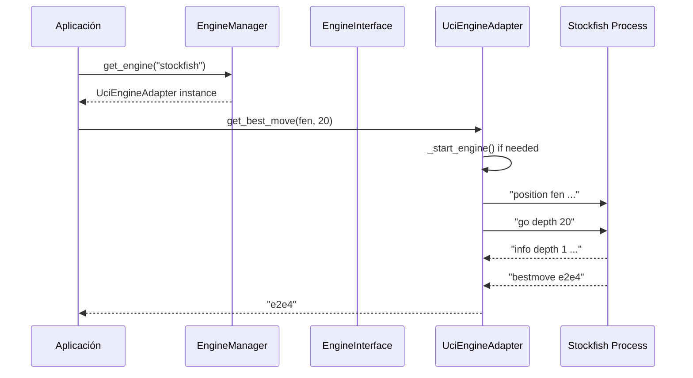

# 📐 Diagrama de Clases UML - Engine Manager

## Diagrama de Clases Completo

```mermaid
classDiagram
    class EngineInterface {
        <<abstract>>
        +get_best_move(fen, depth)* str
    }
    
    class UciEngineAdapter {
        -command str
        -process Process
        +__init__(config)
        -_start_engine()
        -_write_command(command)
        -_read_until(expected)
        +get_best_move(fen, depth) str
    }
    
    class RestEngineAdapter {
        -method str
        -url str
        -params_template dict
        -extract_path str
        +__init__(config)
        +get_best_move(fen, depth) str
    }
    
    class EngineManager {
        -engines dict
        +__init__(config_path)
        +load_config(path)
        +get_engine(name) EngineInterface
    }
    
    EngineInterface <|-- UciEngineAdapter
    EngineInterface <|-- RestEngineAdapter
    EngineManager o-- EngineInterface
    
    note for EngineInterface "Interfaz abstracta (ABC)&#10;Define el contrato para&#10;todos los motores"
    note for UciEngineAdapter "Adaptador para motores UCI&#10;(Stockfish, Komodo, etc)&#10;Comunicación stdin/stdout"
    note for RestEngineAdapter "Adaptador para APIs REST&#10;(Lichess, Chess.com)&#10;Comunicación HTTP/HTTPS"
    note for EngineManager "Factory Pattern&#10;Carga motores desde YAML&#10;Gestiona ciclo de vida"
```



---

## 📊 Descripción de Clases

### 🔷 EngineInterface (Interfaz Abstracta)

**Tipo:** Clase Abstracta (ABC)

**Responsabilidad:** Define el contrato que todos los motores de ajedrez deben cumplir

**Métodos:**
- `+get_best_move(fen: str, depth: int) -> str` (abstracto)
  - Método que debe ser implementado por todas las clases derivadas
  - Parámetros:
    - `fen`: Notación FEN del tablero
    - `depth`: Profundidad de análisis
  - Retorna: Movimiento en notación algebraica

---

### 🔷 UciEngineAdapter (Adaptador UCI)

**Tipo:** Clase Concreta

**Responsabilidad:** Adapta motores que usan el protocolo UCI (Universal Chess Interface)

**Atributos:**
- `-command: str` - Comando para ejecutar el motor
- `-process: asyncio.subprocess.Process` - Proceso del motor en ejecución

**Métodos:**
- `+__init__(config: dict)` - Constructor que recibe configuración
- `-_start_engine() -> None` - Inicia el proceso del motor UCI
- `-_write_command(command: str) -> None` - Envía comandos al motor
- `-_read_until(expected_output: str) -> str` - Lee respuestas del motor
- `+get_best_move(fen: str, depth: int) -> str` - Implementación del método abstracto

**Protocolo UCI:**
```
Cliente                Motor UCI
  ↓                       ↓
uci    ──────────────→
       ←────────────── uciok
isready ─────────────→
       ←────────────── readyok
position fen ... ────→
go depth 20 ─────────→
       ←────────────── info depth 1 ...
       ←────────────── bestmove e2e4
```

**Ejemplos de Motores:**
- Stockfish
- Komodo
- Leela Chess Zero
- GNU Chess

---

### 🔷 RestEngineAdapter (Adaptador REST)

**Tipo:** Clase Concreta

**Responsabilidad:** Adapta motores de ajedrez accesibles vía APIs REST

**Atributos:**
- `-method: str` - Método HTTP (GET, POST)
- `-url: str` - URL del endpoint de la API
- `-params_template: dict` - Plantilla de parámetros con placeholders
- `-extract_path: str` - JSONPath para extraer el mejor movimiento

**Métodos:**
- `+__init__(config: dict)` - Constructor que recibe configuración
- `+get_best_move(fen: str, depth: int) -> str` - Implementación del método abstracto

**Flujo de Comunicación:**
```
Cliente                    API REST
  ↓                           ↓
Formatea parámetros
  ↓
HTTP Request ──────────────→
(GET/POST)
                ←────────────── JSON Response
                              {
                                "pvs": [{
                                  "moves": "e2e4"
                                }]
                              }
  ↓
Extrae con JSONPath
  ↓
Retorna "e2e4"
```

**Ejemplos de APIs:**
- Lichess Cloud Eval API
- Chess.com Analysis API
- Servicios propios en cloud

---

### 🔷 EngineManager (Gestor/Fábrica)

**Tipo:** Clase Concreta (Factory Pattern)

**Responsabilidad:** Gestiona el ciclo de vida de los motores y actúa como fábrica

**Atributos:**
- `-engines: dict[str, EngineInterface]` - Diccionario de motores disponibles

**Métodos:**
- `+__init__(config_path: str)` - Constructor que carga configuración
- `+load_config(config_path: str) -> None` - Carga motores desde YAML
- `+get_engine(name: str) -> EngineInterface` - Retorna motor por nombre

**Configuración (engines.yaml):**
```yaml
engines:
  stockfish:
    type: uci
    command: /usr/local/bin/stockfish
  
  lichess:
    type: rest
    method: GET
    url: https://lichess.org/api/cloud-eval
    params:
      fen: "{fen}"
    extract: "$.pvs[0].moves"
```

**Flujo Factory:**
```
1. load_config() lee YAML
   ↓
2. Por cada motor en config:
   ├─ Si type == "uci"
   │  └─ Crea UciEngineAdapter(config)
   └─ Si type == "rest"
      └─ Crea RestEngineAdapter(config)
   ↓
3. Almacena en dict engines
   ↓
4. get_engine(name) retorna instancia
```

---

## 🔗 Relaciones entre Clases

### Herencia (Inheritance)



- **UciEngineAdapter** implementa **EngineInterface**
- **RestEngineAdapter** implementa **EngineInterface**
- Ambos adaptadores deben proporcionar la implementación de `get_best_move()`

### Composición (Composition)



- **EngineManager** contiene múltiples instancias de **EngineInterface**
- La relación es fuerte: si el manager se destruye, los motores también

### Dependencia (Dependency)

- Todas las clases de alto nivel dependen de la **abstracción** (EngineInterface)
- NO dependen de **implementaciones concretas** (Dependency Inversion Principle)

---

## 🎨 Patrones de Diseño

### 1. 🔌 Adapter Pattern

**Problema:** Interfaces incompatibles

**Solución:**
```python
# Diferentes interfaces convertidas a una común
uci_engine = UciEngineAdapter({"command": "stockfish"})
rest_engine = RestEngineAdapter({"url": "...", "method": "GET"})

# Ambos tienen la misma interfaz
move1 = await uci_engine.get_best_move(fen, 20)
move2 = await rest_engine.get_best_move(fen, 20)
```

### 2. 🎯 Strategy Pattern

**Problema:** Alternar algoritmos en runtime

**Solución:**
```python
# Estrategia seleccionada dinámicamente
strategy = manager.get_engine(user_choice)
move = await strategy.get_best_move(fen, 20)
```

### 3. 🏭 Factory Pattern

**Problema:** Creación compleja de objetos

**Solución:**
```python
# Factory crea el objeto apropiado
manager = EngineManager("config/engines.yaml")
engine = manager.get_engine("stockfish")  # UciEngineAdapter
# o
engine = manager.get_engine("lichess")    # RestEngineAdapter
```

### 4. 🔄 Dependency Inversion Principle

**Problema:** Código acoplado a implementaciones

**Solución:**
```python
# Dependemos de abstracción ✅
def analyze(engine: EngineInterface, fen: str):
    return engine.get_best_move(fen, 20)

# NO de implementación concreta ❌
def analyze(engine: UciEngineAdapter, fen: str):
    return engine.get_best_move(fen, 20)
```

---

## 📝 Leyenda de Símbolos UML

| Símbolo | Significado | Ejemplo |
|---------|-------------|---------|
| `+` | Público | `+get_best_move()` |
| `-` | Privado | `-command` |
| `*` | Abstracto | `+get_best_move()*` |
| `<<abstract>>` | Clase abstracta | `<<abstract>> EngineInterface` |
| `<|--` | Herencia/Implementación | `A <|-- B` (B implementa A) |
| `o--` | Composición | `A o-- B` (A contiene B) |
| `~tipo~` | Genéricos/Parámetros de tipo | `dict~str, int~` |

---

## 🔄 Flujo de Ejecución Completo

### Ejemplo: Analizar una Posición

```python
# 1. Inicialización
manager = EngineManager("config/engines.yaml")
# → load_config() crea UciEngineAdapter y RestEngineAdapter

# 2. Obtener motor
engine = manager.get_engine("stockfish")
# → Retorna instancia de UciEngineAdapter

# 3. Analizar posición
fen = "rnbqkbnr/pppppppp/8/8/4P3/8/PPPP1PPP/RNBQKBNR b KQkq e3 0 1"
move = await engine.get_best_move(fen, depth=20)
# → UciEngineAdapter._start_engine() si no está activo
# → UciEngineAdapter._write_command("position fen ...")
# → UciEngineAdapter._write_command("go depth 20")
# → UciEngineAdapter._read_until("bestmove")
# → Retorna "e7e5"

print(f"Mejor movimiento: {move}")
```

### Diagrama de Secuencia



---

## 💡 Ventajas del Diseño

| Ventaja | Descripción |
|---------|-------------|
| **Extensibilidad** | Agregar nuevos motores sin modificar código existente |
| **Mantenibilidad** | Separación clara de responsabilidades (SRP) |
| **Testabilidad** | Fácil crear mocks de `EngineInterface` para tests |
| **Configurabilidad** | Motores gestionados en YAML, no hardcodeados |
| **Rendimiento** | Operaciones asíncronas para mejor concurrencia |
| **Flexibilidad** | Soporta motores locales y remotos transparentemente |

---

## 🚀 Cómo Visualizar este Diagrama

### En GitHub
El diagrama se renderiza automáticamente al visualizar este archivo `.md` en GitHub.

### En VS Code
1. Instala la extensión "Markdown Preview Mermaid Support"
2. Abre este archivo
3. Presiona `Cmd+Shift+V` (Mac) o `Ctrl+Shift+V` (Windows)

### En Navegador Web
Abre el archivo `class_diagram_mermaid.html` en tu navegador.

### Online
Copia el código Mermaid y pégalo en [https://mermaid.live](https://mermaid.live)

---

## 📚 Referencias

- [Mermaid Documentation](https://mermaid.js.org/)
- [UML Class Diagrams](https://www.uml-diagrams.org/class-diagrams-overview.html)
- [Design Patterns](https://refactoring.guru/design-patterns)
- [SOLID Principles](https://en.wikipedia.org/wiki/SOLID)

---

**Generado con:** Mermaid.js  
**Proyecto:** Chess Trainer  
**Fecha:** Octubre 2025  
**Versión:** 1.0

